# Lanternina, illustrated

This page shows the system instead of arguing for it: what is in the room, what comes out of the printer, what the parent sees in the browser, and the order in which those happen. [README.md](../README.md) says what Lanternina is and why the boundaries are where they are; [docs/ARCHITECTURE.md](ARCHITECTURE.md) says what it costs to keep them. This one is the walk-through, and it is kept separate so that neither has to be read to follow the other.

Every image below is either a photograph of the hardware in the house, an unedited output of the models the system actually calls, or a screenshot of the parent's panel running in its preview mode with invented content. Which is which is written under each one, and listed again in [§10](#10-where-the-images-come-from). No image contains anything an adolescent wrote.

---

## 1. What is in the house

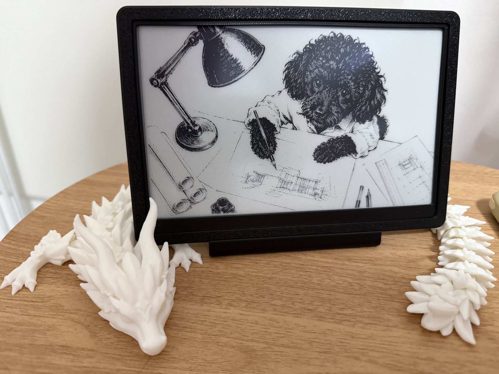

*Photograph. A 7.5" e-paper display in its frame, showing a picture it was sent an hour earlier. The frame and its stand are 3D printed, and so is the dragon lying in front of it.*

One machine and four kinds of thing attached to it.

| | What it is | What it does |
| --- | --- | --- |
| **The hub** | A Raspberry Pi Compute Module 5, 8 GB, on a Waveshare `CM5-PoE-BASE-A`, running Raspberry Pi OS | Holds the clock, the sealing keys, the printer queue and the scanner. It is the only thing that starts work. |
| **The displays** | 7.5" e-paper, 800 × 480, 1-bit, ESP32, battery or mains | Each has exactly one job: show pictures, show an activity, or show a reminder. |
| **The printer** | Epson ET-2870, over IPP | Prints one A4 sheet at a time. |
| **The scanner** | The same machine's flatbed, over eSCL | Reads a sheet that was put back on the glass. About 26 s per page, measured. |

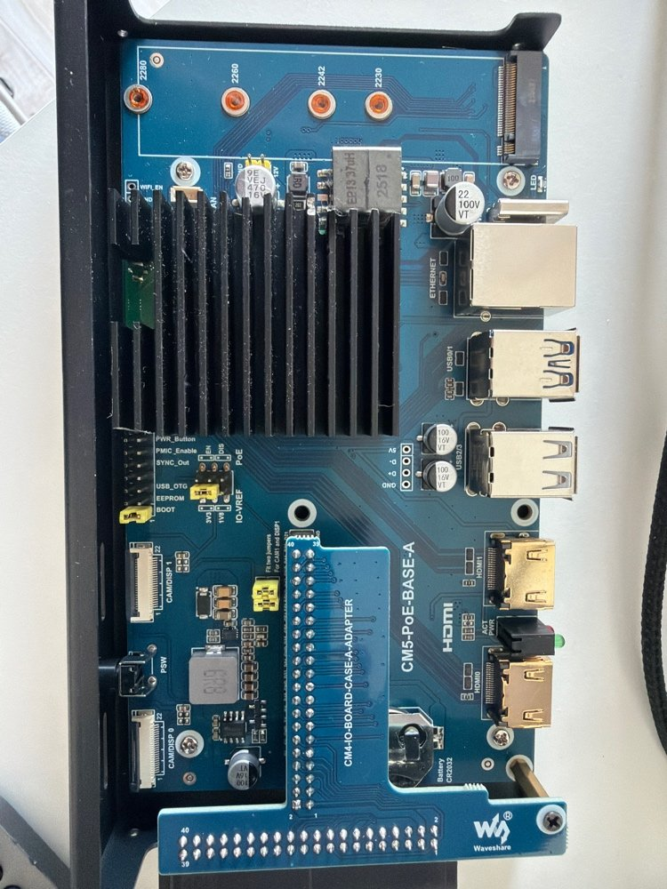

*Photograph. The base board before it went into its case — the part number is silkscreened along the right edge. Power over Ethernet, so the machine is one cable.*

The displays are dumb on purpose. They receive a finished 1-bit bitmap and render it; they hold no fonts and compose no text. That is not a style choice — a device that cannot compose text cannot draw something the safety gate never saw, so the guarantee is a property of the topology rather than of anybody remembering to call a function. What it costs is that every word has to be laid out on the hub before it is sent.

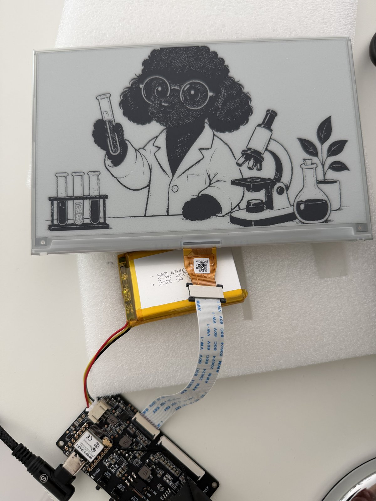

*Photograph. What goes inside a frame: the e-paper panel, a Seeed Studio XIAO ESP32-S3, a 2000 mAh cell and the ribbon between them. The display asks the hub for content and is never contacted the other way round.*

### The frames are 3D printed, and everything is assembled by hand

Two different printers appear in this page and it is worth separating them once. One is an inkjet, and it produces the paper an afternoon runs on; it is part of the system. The other is a filament 3D printer, and it made the objects the hardware sits in; it is not part of the system at all. Everything in this section is the second one.

Every enclosure in the house is 3D printed here — the frames that hold a panel, its board and its battery, and the stand under the one on the table. There are two, and the difference is only how they attach: the black one has a foot and sits on a surface, the white one has a hook that engages the slots of a pegboard.

That is not decoration and it is not a saving. [docs/HARDWARE.md](HARDWARE.md) makes an enclosure a condition a device has to meet before it is interesting at all, on the grounds that a bare board with a ribbon cable taped to a wall is not a thing anybody puts in a room somebody lives in. Nothing bought met the shape, so the frames are drawn and 3D printed.

What is inside them is put together by hand as well: panel, board, cell and ribbon, one unit at a time, then flashed and provisioned over USB. That is worth saying plainly next to the photographs, because photographs of finished objects imply a supply chain that does not exist. A display here cannot be replaced by ordering one, and it is part of why the README says a second house has never been provisioned.

The dragon in the first photograph is 3D printed too, and it is nothing to do with the system. It is worth pointing at anyway: it is what the surface around a display actually looks like, and a photograph staged without it would be describing a different room.

---

## 2. The whole loop, in one diagram

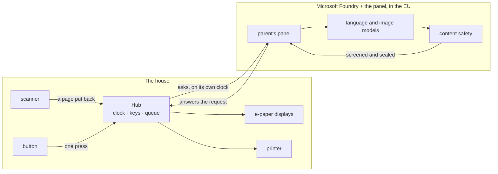
```mermaid
flowchart LR
    subgraph house["The house"]
        hub["Hub<br/>clock · keys · queue"]
        disp["e-paper displays"]
        prn["printer"]
        scn["scanner"]
        btn["button"]
    end

    subgraph cloud["Microsoft Foundry + the panel, in the EU"]
        panel["parent's panel"]
        gate["content safety"]
        models["language and image models"]
    end

    hub -- "asks, on its own clock" --> panel
    panel --> models
    models --> gate
    gate -- "screened and sealed" --> panel
    panel -- "answers the request" --> hub
    hub --> disp
    hub --> prn
    scn -- "a page put back" --> hub
    btn -- "one press" --> hub
```

Every arrow that crosses into the house is the answer to a request the house made. Nothing in the cloud can start an activity, extend one, or push anything onto a display: the panel writes a row, and the hub finds it the next time it asks. That is what makes the dashboard inert — changing a setting stores the new state and makes nothing happen in a room.

The models all run in Microsoft Foundry, in the EU region. No model runs on the device, and there is no offline mode. The trade is stated plainly: one inference path instead of two, and no weights to ship — at the price that a page which comes back while the panel is unreachable stays unread until it is reachable.

---

## 3. An afternoon, from approval to the last page

An afternoon is one document, written in one pass by a model, before anybody has read a word of it. It holds every moment, every version of every moment, the ladder of help under each, and the way out. Nothing is added while it runs.

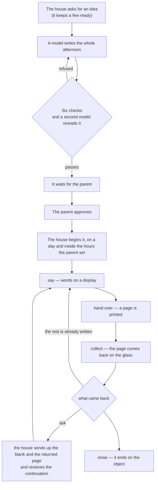
```mermaid
flowchart TD
    A["The house asks for an idea<br/>(it keeps a few ready)"] --> B["A model writes the whole afternoon"]
    B --> C{"Six checks<br/>and a second model rereads it"}
    C -- refused --> B
    C -- passes --> D["It waits for the parent"]
    D --> E["The parent approves"]
    E --> F["The house begins it, on a day and inside the hours the parent set"]
    F --> G["say — words on a display"]
    G --> H["hand over — a page is printed"]
    H --> I["collect — the page comes back on the glass"]
    I --> J{"what came back"}
    J -- "the rest is already written" --> G
    J -- "ask" --> K["the house sends up the blank and the returned page<br/>and receives the continuation"]
    K --> G
    J --> L["close — it ends on the object"]
```

### 3.1 The parent approves it

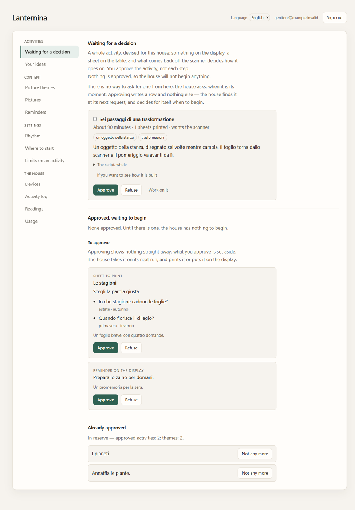

*Screenshot of the panel in preview mode. The content is invented by the fixture, not by a household.*

The parent sees the whole activity and decides once. Approving does not print anything or wake anything: it writes a row, and the house takes it on its next run. There is no button here that starts an afternoon, because the house is the only thing that knows whether now is a sensible moment.

### 3.2 The display says something is waiting

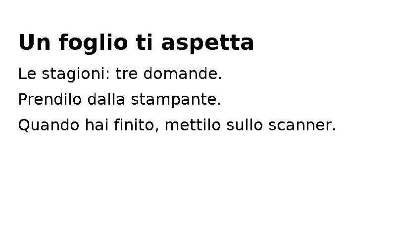

*Rendered by the hub, exactly as sent to the display: 800 × 480, one bit per pixel.*

One thing at a time, and nothing to scroll. The display does not refresh unless something changed, which is why it can sit in a room all day on a battery.

### 3.3 A page is printed

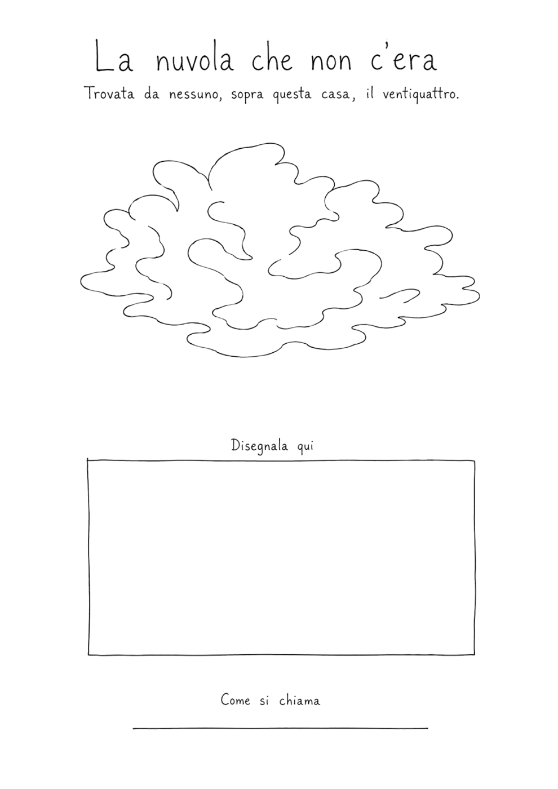

*Drawn whole by `gpt-image-2` from a prompt that had already passed the safety gate. Unedited output.*

The whole sheet is one image, drawn in one pass. There is no layout engine: no declared grid, no corner markers, no QR code, nothing printed on the paper that exists for a machine to find. The design work is the prompt.

The words are not invented by the image model. Every string on the page was written by the model that devised the afternoon, passed the safety gate, and is then quoted into the drawing prompt with an instruction to letter exactly those characters. That is what makes the accented Italian come out right.

It is not a guarantee. The next image is the counter-example.

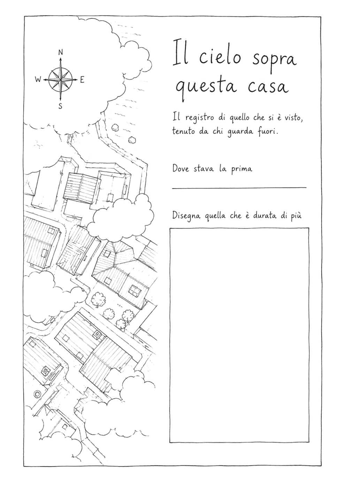

*The same pipeline, drawing a map. Look at the compass rose: it carries N, W, E and S, against a prompt line that forbids exactly those letters. An image model can put a word on paper that nobody filtered. The cost is declared and it is not eliminable.*

Two more figures, measured on this deployment: a page takes 19–33 s to draw, and covers 0.5–2.7 % of the sheet in ink.

### 3.4 It comes back written on

| Handed over | Came back |
| --- | --- |
|  | 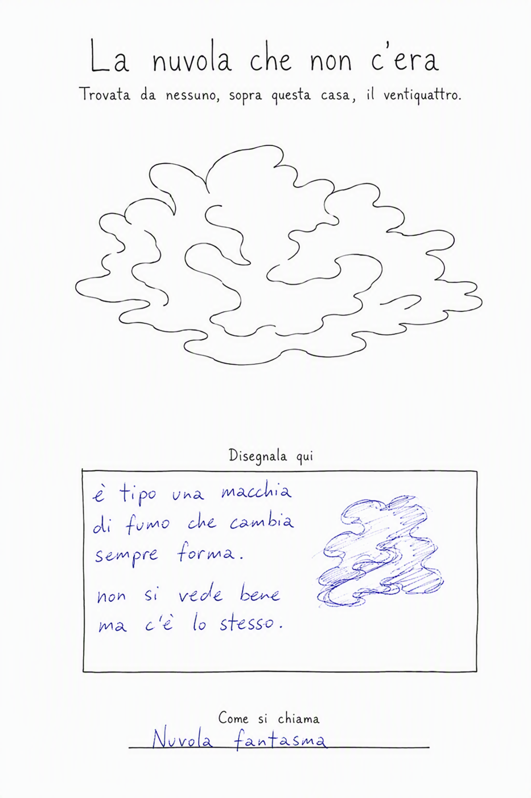 |

*Left: what the printer produced. Right: the same sheet filled in. The right-hand image is the simulated hand — `tools/handwriting.py` asks an image model to fill the blank in, so that a whole afternoon can be exercised with no person in it. A real afternoon's sheet is never committed to this repository.*

Reading is done by handing a model both images and asking what is different. That is the whole mechanism. It takes 4.4–5.5 s, measured.

The reader's vocabulary is deliberately poor: a page came back with **marks** or **blank**, and nothing else. Not a count, not a fraction, not "half of them" — because a count of somebody's marks is one step away from a score. Which particular boxes carry a mark is a richer question, and it is only ever carried upward inside an `ask`, to write the next moments with.

The reading is not kept. It lasts as long as the afternoon needs it and is then gone: `WhatCameBack` refuses to be pickled, copied or cached. The only account of how an afternoon went is the paper, and the paper stays on the table.

### 3.5 It ends

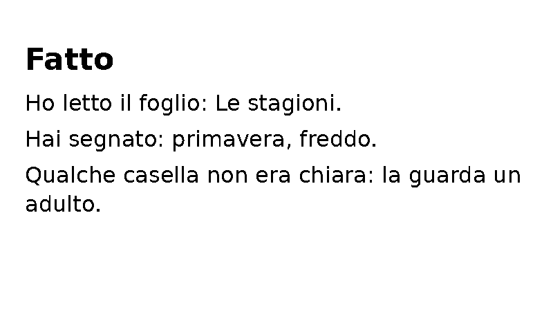

*Rendered by the hub, as sent to the display.*

Thirty minutes before the hour the parent agreed to, the way out begins, whatever the afternoon has reached. The ending it arrives at is the same ending, and no display ever says that it was shortened. That is possible because every moment was written in three lengths at the time the document was written — shortening is picking a column somebody already wrote, not editing somebody's words at runtime.

### 3.6 The shape of one moment

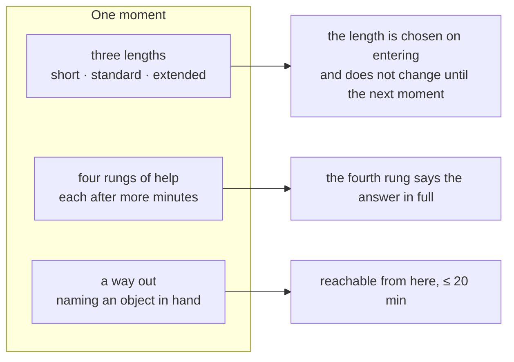
```mermaid
flowchart LR
    subgraph m["One moment"]
        w["three lengths<br/>short · standard · extended"]
        h["four rungs of help<br/>each after more minutes"]
        o["a way out<br/>naming an object in hand"]
    end
    w --> pick["the length is chosen on entering<br/>and does not change until the next moment"]
    h --> last["the fourth rung says the answer in full"]
    o --> end2["reachable from here, ≤ 20 min"]
```

Every moment carries all three. That is what lets the same moment be shortened when the clock is tight, put on a display that holds forty words, or turned into a page — and reach the same ending whichever way it went.

Measured across the four batches recorded in [experiments/](../experiments/README.md), 22 afternoons: devising one takes **68–157 s**. In the most recent batch of six, on 4 September 2026, the median was **139.8 s** and six of six passed the checks.

---

## 4. The four channels

Which channel a moment lands on is a decision the format has to survive, so all four are described in the same document.

| Channel | Direction | What it leaves behind |
| --- | --- | --- |
| **Paper** | house → room | The sheet, on the table, when it is over. |
| **The display** | house → room | Nothing. It changes and holds. |
| **A physical button** | room → house | Nothing. It confirms, asks for help, or says done. |
| **The handheld camera** | room → house | A photograph, in a gallery its owner can delete from. |

Paper is the only one that leaves something behind.

Two of the four are being built right now, as objects, and neither has a line of code behind it yet.

**The camera.** The only channel where the initiative sits with the adolescent. `vision/` is an empty package and nothing in this repository takes a photograph, so every guarantee the README states about it is a design decision that no test would notice being dropped.

**The button panel.** A separate box of physical buttons, so that confirming, asking for help and saying done are three things you press rather than one. Today there is one button and it is the one on the display itself: a press wakes the board, and the hub answers it inside the response to the display's own request. That is enough to close the paper loop and it is not enough to answer a question.

---

## 5. Pictures, when nothing is running

Most of the time no afternoon is running, and the display is a picture that changes.

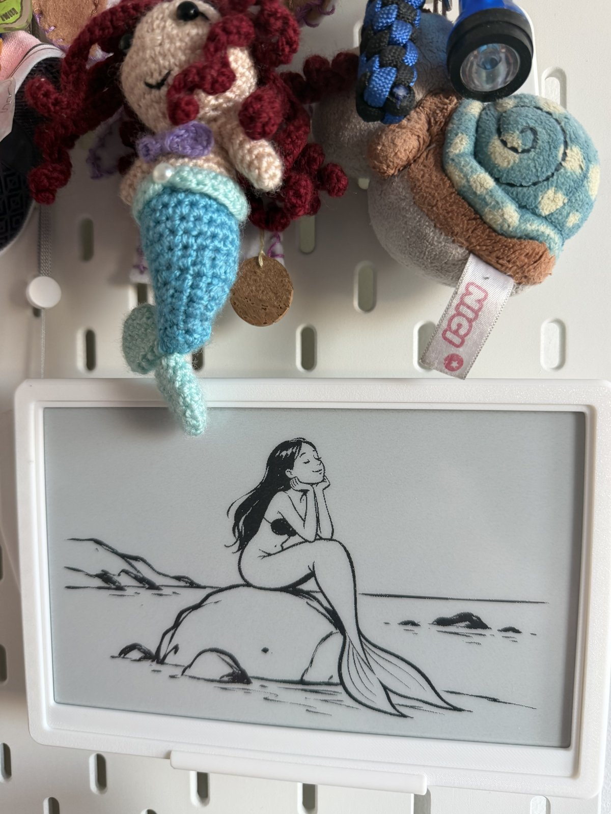

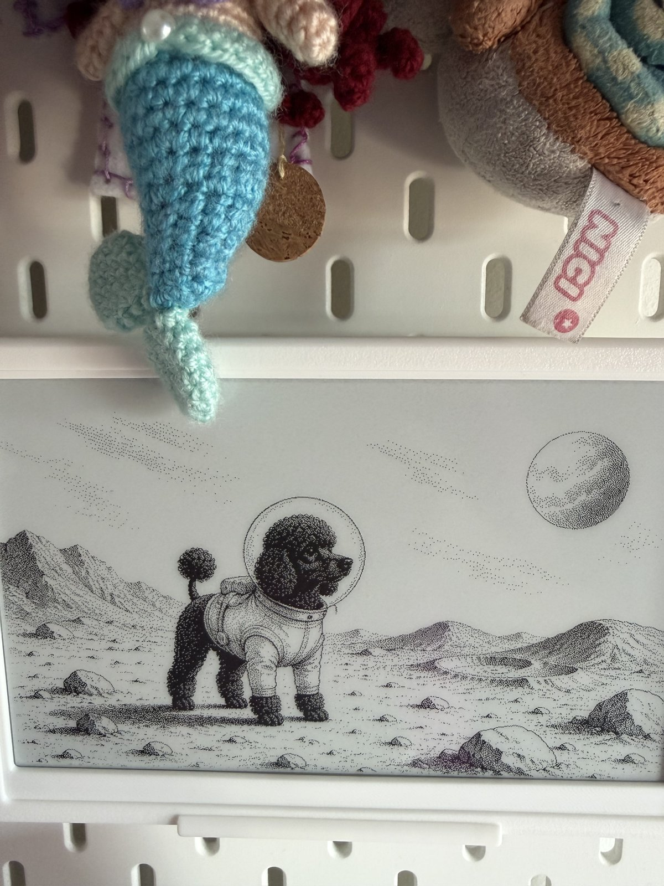

*Two photographs of the same display, in the same place, at two different times. The house asked for a picture, was given one, and put it up; an hour later it did that again. Nothing else in the room changed, and nobody asked for either of them. The white frame is the 3D printed one with the hook, holding onto the pegboard.*

The parent writes the themes; the house picks one and asks for a picture on its own schedule. What arrives at the display is 1-bit, dithered, at 800 × 480:

*The bitmap as sent: Floyd–Steinberg dithering with the extremes flattened, because otherwise autocontrast puts speckle across the white.*

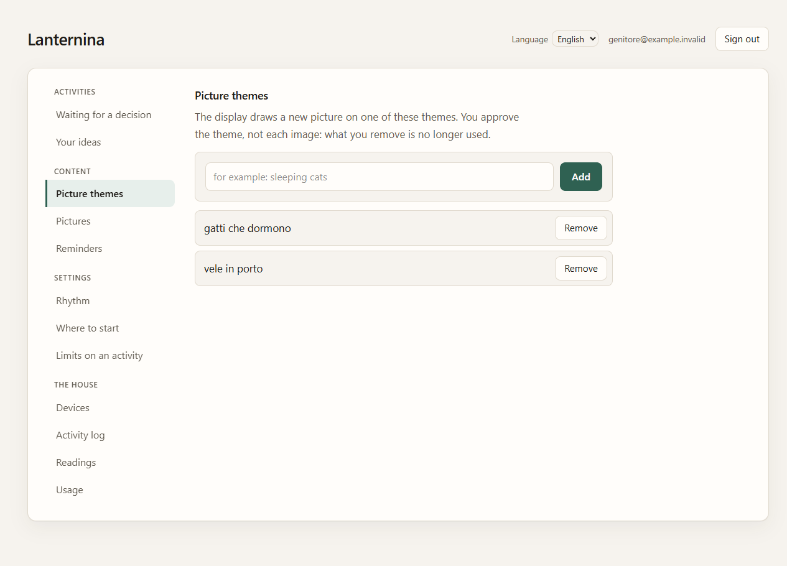

*Screenshot, preview mode.*

Two things about this loop are worth knowing because they were both bugs. The prompt used to be a pure function of the theme, so the same theme produced the same picture every time; a "manner" is now drawn at random and recorded, which changes how something is drawn and never what it says. And the rule that picks the least recently used theme *amplifies* a persistent failure rather than absorbing it — a theme that cannot be archived stays "never used", so it is chosen every time. That one was found after four consecutive failures, and the cause was a typographic apostrophe in a blob metadata header, which is Latin-1.

---

## 6. Reminders

A display can be given the reminder job instead of the picture job. Sentences the parent writes are placed in time by a model — inside the reply to the request the house made — and shown in a thirty-minute window around their hour.

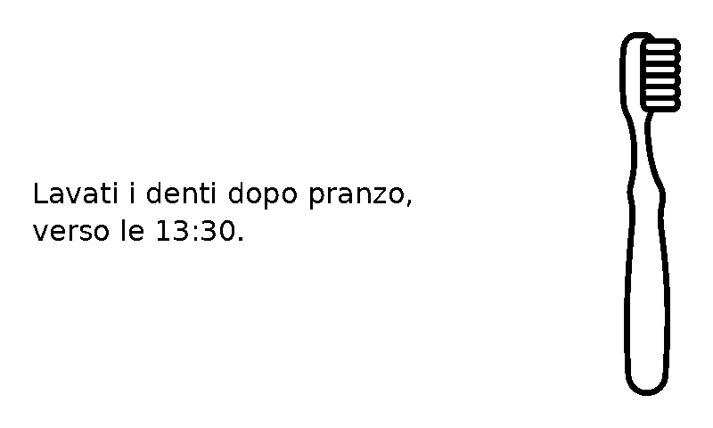

*Rendered by the hub, as sent to the display. The sentence is a fixture, not one anybody in a house wrote.*

Pressing the button while a reminder is up dismisses it. That is handled in the one place that knows what the display is showing at the instant of the press: the HTTP handler that answers the display's own request, in the same response.

There is a photograph of two displays side by side in a room, one carrying pictures and one carrying a reminder, and it is deliberately not in this page. The reminder on it is a real one, and a real reminder is a routine — which is on the short list of things this repository never keeps. The rendered fixture above shows the same thing and costs nothing.

---

## 7. Using the panel

The panel is a static single-page application; the API is a container app. It has four groups of sections, and no section in it can make something happen in a room.

### The rhythm

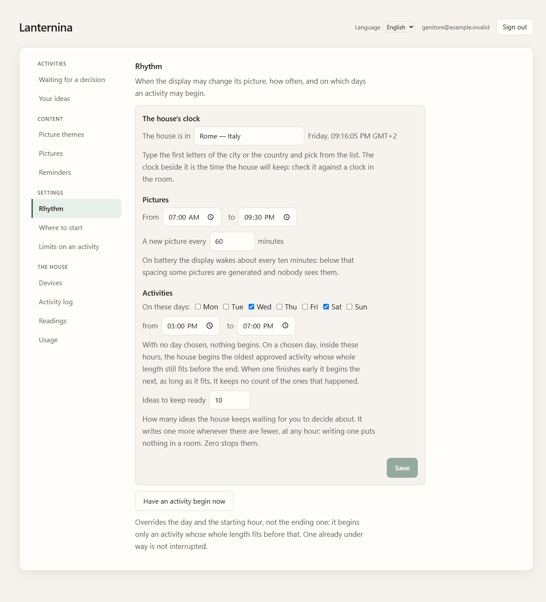

*Screenshot, preview mode.*

This is where the clock is set, and it is the setting that does the most work. The house's timezone, the hours in which the display may change its picture and how often, the days and the hours in which an activity may begin, and how many ideas the house keeps ready for the parent to decide about.

Three sentences on that page are the design, not the copy. With no day chosen, nothing begins. On a chosen day the house begins the oldest approved activity **whose whole length still fits before the end** — so an ending is never a cut-off. And it keeps no count of the ones that happened, because a count is the first ingredient of a streak.

"Have an activity begin now" overrides the day and the starting hour, and not the ending one.

### The house

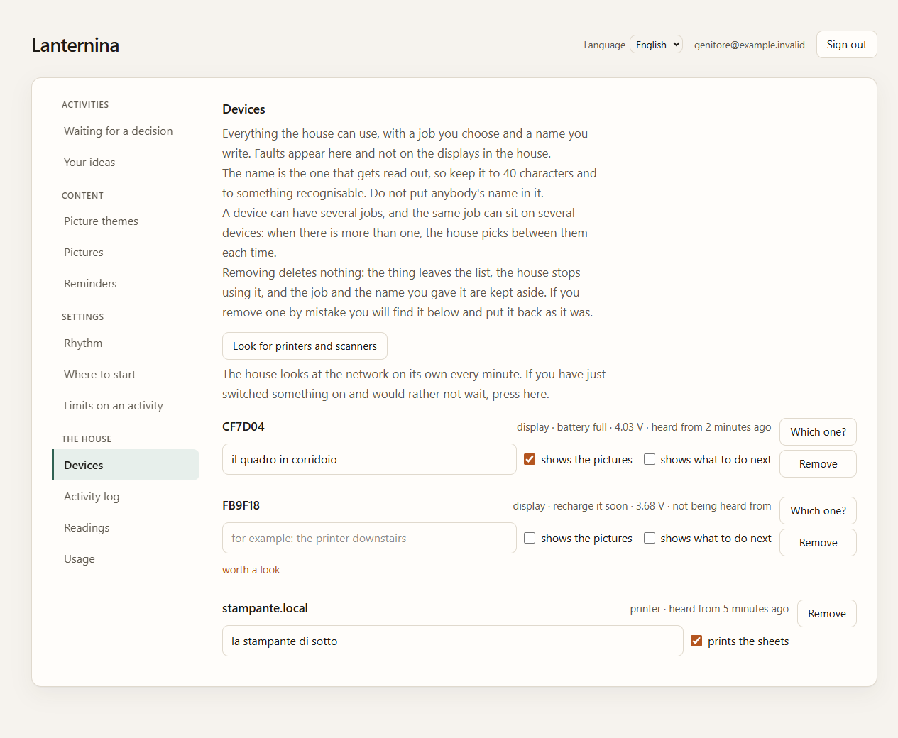

*Screenshot, preview mode.*

One list holds the displays, the printers and the scanners. Each thing gets a name the parent chooses and one job. A job belongs to one thing: assigning it takes it away from whoever had it. Anything that has never been named at all is a third state, distinct from "no job", and it is what keeps a hub alive that cannot currently reach the panel.

### The limits

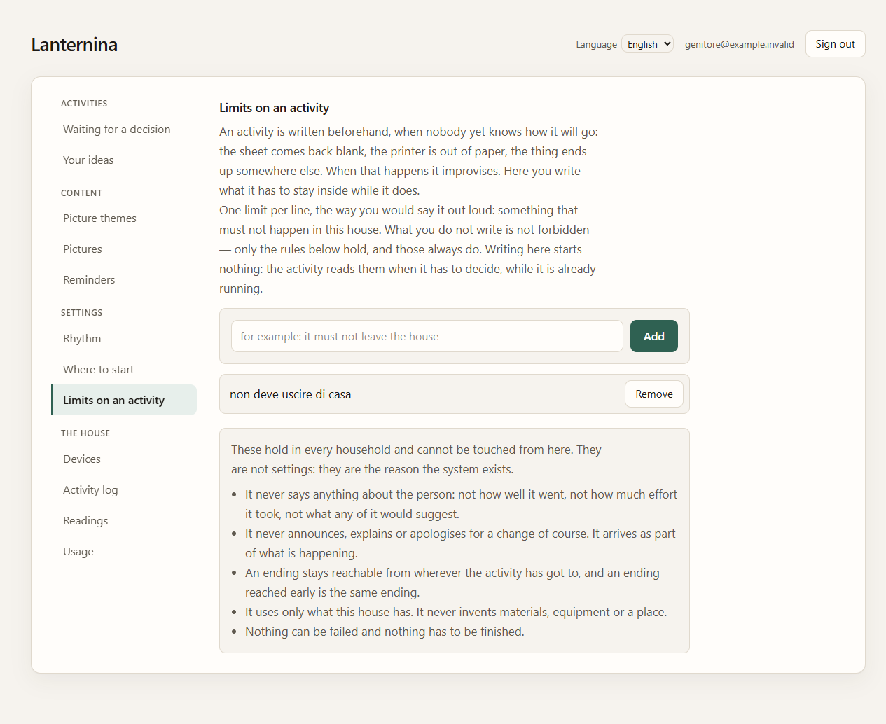

*Screenshot, preview mode.*

One limit per line, in the words the parent would use out loud. What is not written is not forbidden. Below them are the limits that hold in every household and cannot be edited from here — they are not settings, they are the reason the system exists.

### The ideas

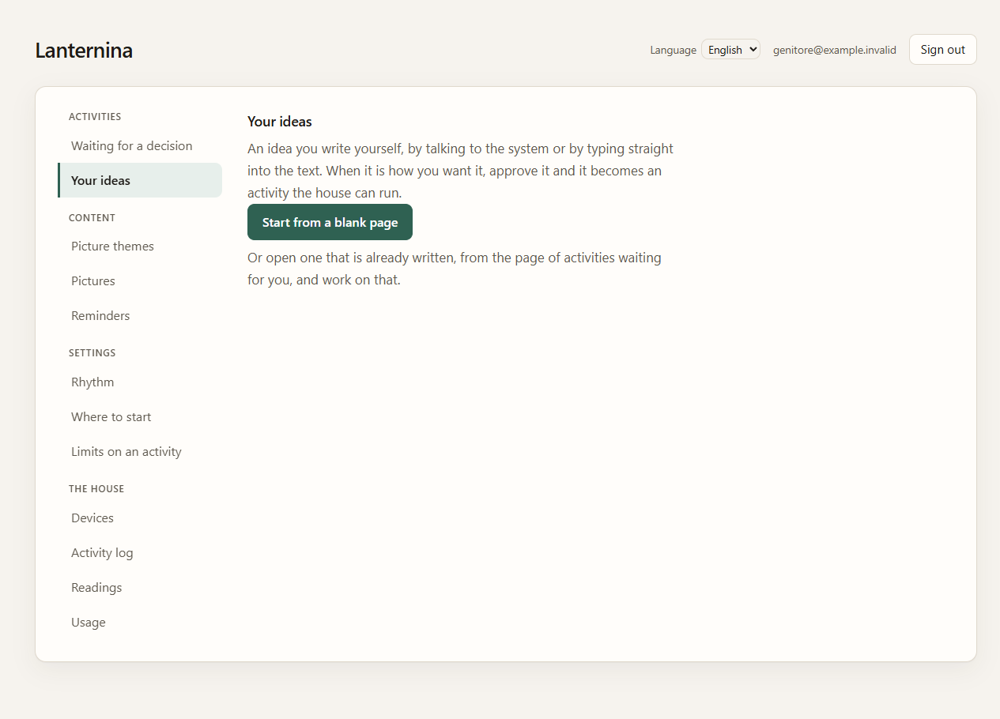

*Screenshot, preview mode.*

The parent can write an idea of their own and have it turned into an activity, which then waits for their approval like any other.

---

## 8. What has been measured

Every figure here was measured on this deployment, not estimated. Dates matter because prompts change and the numbers move with them.

| | Measured | When |
| --- | --- | --- |
| Devising an afternoon | 68–157 s over 22 afternoons; median 139.8 s in the last batch of 6 | 3–4 Sep 2026 |
| Rereading it with a second model | 14.4–22.8 s | 3 Sep 2026 |
| Drawing one page | 19–33 s | 24 Aug 2026 |
| Ink on a drawn page | 0.5–2.7 % of the sheet | 24 Aug 2026 |
| Reading a returned page | 4.4–5.5 s | Aug 2026 |
| Scanning a sheet | ≈ 26 s | 19 Aug 2026 |
| Button press to the reading landing | ≈ 35 s | 19 Aug 2026 |
| Printed ruler on paper | 50 mm asked, 50 mm measured | 4 Aug 2026 |

The last row is the one that is not about speed. The print chain does not rescale: a 50 mm calibration ruler on a rendered sheet measures 50 mm with a ruler on the paper. That was checked by hand, because a chain that silently rescales would make every physical dimension on every page wrong in a way no test would notice.

---

## 9. What is not built

A page of photographs makes a system look more finished than it is, so this section is not optional.

- **The handheld camera.** Being assembled by hand as an object; nothing here takes a photograph. `vision/` is empty. The acknowledgment on the display within seconds of a press is part of the channel and is not built either. A device on a bench and an empty package are not the same distance from working, and the second is the longer one.
- **The button panel.** Being assembled by hand as well. Nothing in the repository expects more than the one button already on each display.
- **That a reading never lands in a store.** The type refuses to be pickled, copied or cached, but the reading travels from the house to the panel and back as a request body, and nothing stops either end writing that body down. One household named in `panel/keeping.py` deliberately does keep it, for a fortnight, while this is being built.
- **The seventh property.** That every moment has an answer that can be wrong, and that the last moment produces something worth keeping, is specified and not checked. A plan that fails it is saved.
- **The plain-language memory view.** There is no page that renders the whole household memory as sentences. Until there is, the enforcement that replaces locality does not exist.
- **A second house.** Never provisioned. The installer's `--install` has never been run.

---

## 10. Where the images come from

| Image | Kind |
| --- | --- |
| `images/photos/*.jpg` | Photographs taken in the house, August 2026. Converted from HEIC, resized to 1600 px, otherwise unedited. |
| `images/paper/label-blank.png`, `map-blank.png`, `notebook-blank.png` | Unedited output of `gpt-image-2`, drawn from prompts that had passed the safety gate. |
| `images/paper/label-written.png` | The same blank filled in by `tools/handwriting.py`, which asks an image model to write on it. No person wrote on this sheet. |
| `images/screens/*.png` | Bitmaps rendered by the hub, byte-for-byte as sent to a display. |
| `images/panel/*.png` | Screenshots of the panel running locally in preview mode: a fake API and fixture content, no household and no identity provider. |

The photographs of a display show whatever picture that display happened to be holding when the photograph was taken. Those pictures were generated by the system from themes a parent wrote.
