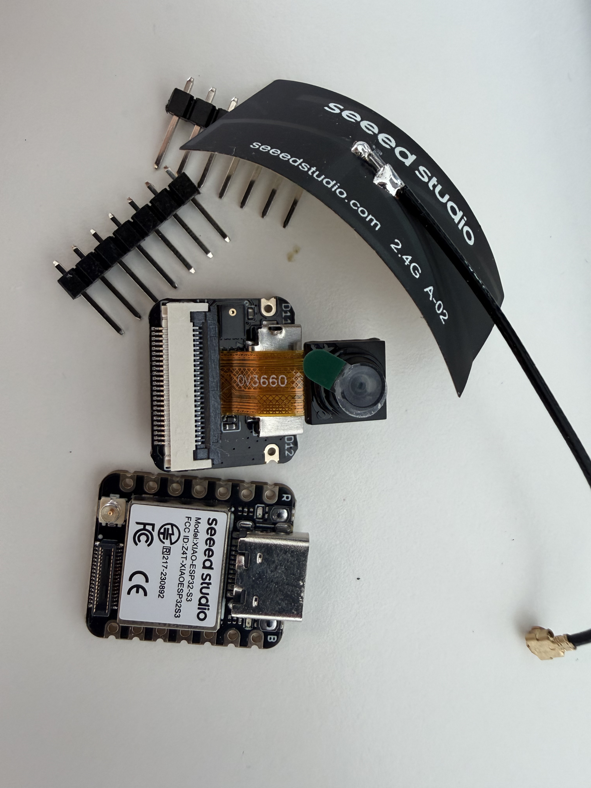
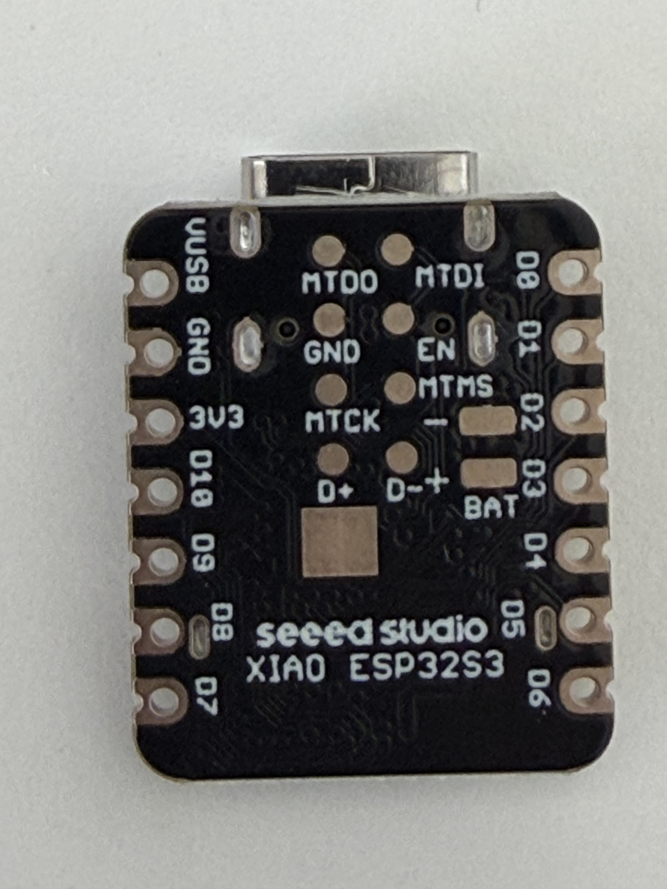

# The camera

Lanternina's camera uses a Seeed Studio XIAO ESP32S3 and Sense expansion board. The person holding it frames an object and presses a button. The device takes a photograph and signals the outcome with an LED. The design calls for delivery to lanternina hub over the home Wi-Fi network.

The installed firmware assigns the shutter to D1/GPIO2 and the external LED to D4/GPIO5. The owner reported both wiring changes on 9 September 2026. Flash verification and authenticated status passed; D1 reads HIGH and D4 is an output at LOW while idle. D3 and the former LED pin D2 are unused inputs without internal pulls. The [firmware operations guide](../../firmware/camera/README.md) records the checks; button, visible LED and battery-wake acceptance remain physical tests.

## The device



The photograph shows the base board marked `XIAO-ESP32-S3`, the Sense expansion, the 2.4 GHz antenna and two separate pin headers. The `OV3660` marking on the ribbon cable identifies the camera module. Seeed specifies a maximum resolution of 2048 x 1536 pixels for this sensor; the installed capture tests identified OV3660 and produced 1600 x 1200 JPEGs.

The expansion also includes a microSD slot and a microphone. The design uses the camera and proposes microSD storage for photographs awaiting delivery. The camera firmware will not initialise the microphone. A microSD card, button, LED and battery are not shown in the photographs.

## Parts for the button and LED

| Quantity | Component | Required specification |
| --- | --- | --- |
| 1 | Momentary push button | Normally open, non-latching contact; two terminals or `COM` and `NO` contacts |
| 1 | Diffused red or amber LED | Ordinary two-lead LED suitable for a few mA; not a 12 V indicator module |
| 1 | 470 ohm resistor | Rated at 0.25 W; connected in series with the LED |
| Several | Flexible insulated wires | Keep them short; approximately 15 cm or less inside the enclosure is an assembly guideline |
| As needed | Heat-shrink tubing and support | Insulation for terminals and strain relief to keep wires from pulling on solder joints |
| 1 | USB-C data cable | Power and programming during testing |

The button must close a contact when pressed and open it again when released. Illuminated buttons have separate contacts for the light and the switch: this guide uses an independent external LED.

## Wiring diagram

The shutter connects D1/GPIO2 to ground. The LED connects D4/GPIO5 through its series resistor, approximately 220 ohms in the earlier reported assembly. Keep unused wire ends insulated, including the board-side D3 wire. The pin map below describes the wiring reported by the owner.

The button and LED share only ground. The LED anode connects to `D4/GPIO5` through its resistor; the cathode returns to ground. There is no wire between the button signal and the LED. The firmware reads one GPIO and controls the other, so it can flash the LED after the button has been released.

## Where to solder on this board



The view below matches the second photograph. We are looking at the rear, with the `XIAO ESP32S3` marking and `BAT` pads, and the USB-C socket at the top. Left and right are reversed when looking at the component side instead.

```text
                   USB-C
             +---------------+
     VUSB   o               o   D0  GPIO1
     GND    o               o   D1  GPIO2  --> button
     3V3    o               o   D2  GPIO3  --> unused
     D10    o               o   D3  GPIO4  --> unused; old wire insulated
     D9     o               o   D4  GPIO5  --> resistor and LED
      D8     o               o   D5  GPIO6
      D7     o               o   D6  GPIO43
             +---------------+
                  REAR VIEW
```

We use three edge pads on the base board: `D1`, `D4` and `GND`. In the photograph, D1 is the second pad from the top on the right, D4 is the fifth on the right and GND is the second on the left. Check the printed labels before soldering. The central BAT, D+, D-, EN and JTAG pads are not needed for these connections.

| Function | Board label | Chip GPIO | Firmware configuration |
| --- | --- | --- | --- |
| Button input and sleep wakeup | D1 | GPIO2 | `INPUT_PULLUP`; pressed = `LOW` |
| Retired button input | D3 | GPIO4 | Input without pull-up or pull-down; leave disconnected |
| External LED output | D4 | GPIO5 | `OUTPUT`; lit = `HIGH` |
| Common return | GND | Ground | Connected to both the button and the LED cathode |

The board labels differ from GPIO numbers: D1 is GPIO2 and D4 is GPIO5. PlatformIO uses the `seeed_xiao_esp32s3` board target.

Seeed assigns GPIO10-18, GPIO38-40, GPIO47 and GPIO48 to the camera. The microSD uses GPIO7, GPIO8, GPIO9 and GPIO21; the microphone uses GPIO41 and GPIO42. GPIO2 and GPIO3 are outside these assignments. The built-in user LED is on GPIO21, shared with the microSD chip select: we do not use it to confirm a photograph. The charging LED indicates the state of the power circuit, not a capture.

## Wiring the button

Solder with USB and battery disconnected. Connect one button terminal to `D1` and the other to `GND`. Connect the cut wire leading to the button to D1; leave the wire attached to D3 insulated. The button has no polarity. If it has three labelled terminals, use `COM` and `NO`, leaving `NC` unconnected.

```text
  Internal 3V3
       |
  Internal chip pull-up, enabled by firmware
       |
     D1 / GPIO2 -------- normally open button -------- GND
```

The internal resistor holds the input high while the button is released. Pressing the button connects the input to ground. The USB-powered prototype needs no external resistor on the button. Do not connect the button to `VUSB`, 5 V or battery positive: the GPIOs operate at 3.3 V and are not 5 V tolerant.

A four-leg tactile button contains two internally connected pairs. With the board disconnected, use a multimeter in continuity mode to find two terminals that are open at rest and connected when pressed. Use those terminals; two legs from the same internally connected pair would make the input appear permanently pressed. The physical arrangement of the legs alone is not enough to identify them.

## Wiring the LED

Connect `D4` to one end of the series resistor. The earlier reported assembly uses approximately 220 ohms; the earlier proposal used 470 ohms, which gives less LED current. Connect the other end to the LED anode. Connect the cathode to `GND`, the same return used by the button.

```text
     D4 / GPIO5 ---- [ 220 ohm ] ---- anode LED cathode ---- GND
```

On a new LED, the anode usually has the longer lead. The cathode usually has the shorter lead and sits next to the flat side of the base. If the leads have been cut or the package differs, check polarity against the datasheet or with the multimeter's diode function. The resistor has no polarity and may sit on either side of the LED, provided it is in series.

With a 3.3 V output and an assumed LED forward voltage between 1.8 and 2.2 V, the calculated current is between 2.3 and 3.2 mA: `(3.3 V - Vf) / 470 ohm`. Calculated resistor dissipation stays below 5 mW. These are electrical estimates, not measurements of the LED; brightness and actual forward voltage depend on the component. The 0.25 W resistor has margin for this load.

The firmware controls the LED, rather than the button contact. Wiring it directly to the button would indicate only that the contact has closed, even if the program has stopped. Connecting it directly to the GPIO without a resistor can damage the LED or the output. A 5 V or 12 V panel indicator requires a different circuit: do not substitute it for the LED described here.

## Assembly order

1. Disconnect all power sources. Identify `D1`, `D4` and `GND` from the rear silkscreen labels.
2. Test the button with the multimeter and identify the LED anode and cathode.
3. Solder the connections to the edge pads, or solder the kit's headers and test on a breadboard. Avoid solder bridges to neighbouring pads or the metal shield.
4. Join the two ground returns at a small insulated junction and run a single wire to `GND`. This avoids crowding two wires onto the small pad.
5. Insulate the resistor and joints with tubing. Secure the wires to the support, leaving a little slack near the board.
6. Check continuity between `D1` and `GND`: they should connect when pressed. Check for metallic bridges between adjacent pads. Measurements through the board's semiconductors are not equivalent to a metallic short circuit.
7. Fit the camera module and antenna following Seeed's instructions, an operation already familiar to the builder. Remove the lens protection film visible in the first photograph before testing image capture.
8. Start with USB-C power only. Stop the test if there is an unusual smell, abnormal heating or repeated resets.

The enclosure must support the button without transferring pressure to the board. The LED must be visible to the person framing the photograph, rather than pointing at the subject like a flash. The lens, antenna and USB-C socket must remain unobstructed; insulating spacers prevent contact between the board, screws and battery.

## What the light must confirm

The firmware distinguishes image acquisition from delivery. Delivery means that lanternina hub has acknowledged durable storage of that image, not that a model has read it or an activity has used it. The sequence below is installed as of 9 September 2026; visible timing and movement after acquisition remain physical acceptance checks.

| Event | External LED | Meaning |
| --- | --- | --- |
| Idle, device powered | Off | No feedback being signalled; this alone cannot distinguish idle from loss of power |
| Accepted press and image acquisition | Continuously on until the selected framebuffer is acquired | Keep the framing still while lit; light-off means acquisition has ended |
| Local storage, upload or waiting for Wi-Fi | Off | Framing may change, but storage and delivery are not yet confirmed; keep power connected |
| Valid hub acknowledgement for this capture after durable storage | Two 150 ms flashes separated by 150 ms off, then off | The image has been received and stored by lanternina hub |
| Upload timeout, rejected response or missing acknowledgement | No delivery-confirmation flashes | Keep the local copy for retry; do not declare success |
| Capture or storage failed | Three 150 ms pulses separated by 150 ms off, then off | The photograph was not stored |

The initial light duration follows acquisition, not a fixed timer. The installed firmware uses 150 ms delivery/error pulses and at least 500 ms of darkness between acquisition and later feedback. An atomic flag communicates framebuffer completion to the LED loop. An acquisition failure also ends the light, followed by the error sequence; light-off does not certify a saved photograph. The USB test measured framebuffer readiness at 543 ms and verified the LED output had switched off before delivery. This is not a physical press-to-exposure measurement.

The firmware uses a 30 ms debounce interval, generates one event per accepted press and requires a stable release before rearming. Holding the button does not extend the acquisition light. Presses while capture, storage, network work or feedback are in progress are ignored without a new light signal and are not queued. At cold startup a held button waits for release; an EXT0 button wake starts one capture.

Each acknowledgement must match a pending capture identifier. Duplicate acknowledgements must not replay its completion signal. If an acknowledgement arrives during another flash sequence, finish that sequence and preserve the dark interval before signalling delivery. When Wi-Fi returns, two flashes can therefore confirm an earlier queued image, not necessarily the most recent press. A single LED cannot identify which photograph was delivered; that information belongs in the hub's receipt record. The firmware must remain awake until a scheduled confirmation sequence finishes.

An error must end the operation within a configured timeout; values will be chosen after the first measurements. The program must release the frame on failure too and become ready again. The brief error signal makes a missing photograph observable, but whether people understand it remains a test to perform, not an established property.

## How it fits into Lanternina

The camera photographs constructions, objects and work that do not fit in the scanner. The person using it chooses the subject and when to capture it. The scanner remains the existing path for sheets of paper.

The complete proposal follows this sequence:

1. The button triggers a single capture through the `esp32-camera` driver, configured for the XIAO Sense and the detected sensor. PSRAM must be enabled; the board name alone does not establish that it is available.
2. The firmware writes the JPEG to a temporary file on microSD, checks the bytes written and reads them back, closes the file and promotes it to the queue of ready photographs. Recovery at startup must distinguish incomplete files from complete ones; the FAT filesystem alone does not guarantee resilience to power loss.
3. The saved image enters the delivery queue without a success flash. The queue has an explicit limit and never silently overwrites photographs awaiting delivery. Capacity and limits will be set after measuring actual JPEG sizes.
4. On the home network, the device delivers the JPEG to an authenticated receiver on lanternina hub. Device identity and a persistent capture identifier allow retries without creating copies. A name based only on `millis()` does not survive restarts.
5. The hub acknowledges only after accepting durable responsibility for the file. The camera validates the acknowledgement against the capture identifier, schedules the two-flash delivery confirmation and deletes its local copy after acknowledgement. A lost response triggers delivery with the same identifier, not a new photograph or a premature success signal.
6. The hub presents the photograph through the path chosen for the activity. A late photograph is not automatically assigned to the active moment: that association must be defined before integration.

The receiver, LittleFS queue and time-bound activity association are implemented; the numbered sequence above preserves the earlier microSD proposal. USB capture and receiver-offline retry were verified on 9 September 2026. The authenticated family archive retains originals during development and supports deletion with tombstones. Photographs remain outside Git. Physical activity trials, power interruption and the intermittent shutter fault remain open. The [operations guide](../../firmware/camera/README.md) gives the current commands, measured timings and recovery procedure.

Credentials will be individual, revocable and kept outside source files. The transport must also authenticate the receiver, for example through HTTPS with certificate verification; home Wi-Fi does not replace that check. Receiving an arbitrary HTTP code is not enough to declare success: the expected status and an acknowledgement of the same capture are required. Google Drive, WebDAV and FTP are not dependencies of this miniproject.

## Power and battery life

The base XIAO ESP32S3 has no internal connection from BAT to an ADC input. Seeed states this explicitly in its Battery Usage documentation. The current device therefore reports USB presence and an unavailable battery voltage. The parent inventory must not call that missing reading a charged battery.

An optional measurement circuit can use BAT+ through 100 kilohms to D0/GPIO1, with another 100 kilohms from D0 to GND and a 100 nF capacitor from D0 to GND. The calculated divider voltage at a 4.2 V battery is 2.1 V, and its continuous draw is 21 microamps. Connect it only with USB and battery disconnected; never connect BAT+ directly to a GPIO. Enable `CAMERA_BATTERY_GPIO=1` only after verifying the divider wiring and comparing its reading with a meter. The firmware supports that optional 2:1 divider, but it is disabled on the current unit because the circuit has not been assembled or calibrated.

The camera reports its last observed state to the hub at boot, during capture delivery and once a minute on a live USB bus. While sleeping on battery it makes no periodic network calls. The parent panel displays the last observation rather than inferring a fault from sleep. USB presence does not establish whether a battery is connected or charging.

The first prototype uses USB-C to separate capture tests from power-supply problems. The portable version will require a protected, rechargeable single-cell LiPo battery, nominally 3.7 V, compatible with the charger on this board revision. The `BAT` pads are on the base board; this guide does not yet prescribe battery wiring. Do not use `VUSB` or `3V3` in place of `BAT`, and do not solder directly to the cell.

Seeed reports approximately 3 mA in deep sleep for the Sense with expansion, compared with 14 microamps for the base board: these are manufacturer figures, not measurements of this unit. We cannot infer battery life from the ESP32-S3 alone. Measurements must include the actual camera, microSD, LED and power regulation, including capture and Wi-Fi current peaks.

The D1 firmware uses GPIO2 for EXT0 wakeup and enables its RTC pull-up before sleep. Its wake cause, button release and one-capture-per-press behavior require verification after soldering the new connection.

## Testing

| Test | Required result | Status on 7 September 2026 |
| --- | --- | --- |
| Identification from photographs | XIAO ESP32S3, Sense expansion, OV3660 marking | Verified in both photographs |
| Pin assignments | GPIO1 and GPIO4 available; rear map agrees with Seeed | Verified against photographs and documentation |
| Kit photograph conversion | Two readable JPEGs, 3024 x 4032 pixels, without EXIF | Verified with Pillow |
| Button released and pressed | GPIO2 high and low respectively | 3.2 V measured unloaded; button wiring pending |
| Ten separate presses while ready | Ten events, each with continuous light until acquisition ends | To test |
| Button held for 5 s | One capture; acquisition light follows framebuffer completion, not button release | To test |
| Valid hub receipt after button release | Two flashes only after acknowledgement of durable storage for that capture | To test |
| Immediate hub receipt | At least 500 ms dark after acquisition before the two-flash sequence | To test |
| Duplicate or mismatched acknowledgement | No replay for a completed capture; no success for an unknown identifier | To test |
| USB startup with button held | No capture until release and a new press | To test |
| Alternating two recognisable subjects | Each file contains the current subject, not the previous frame | To test |
| microSD missing or full | No delivery confirmation and no overwrite; failed capture receives the error sequence | To test |
| Wi-Fi unavailable | Acquisition light then off, local storage, no success flashes until delivery is acknowledged | Receiver-offline retry verified; full Wi-Fi loss still to test |
| Hub response lost or upload rejected | No success flashes; same capture retried without duplication on the hub | To test |
| Power interrupted during writing | Incomplete file recognised; earlier photographs remain usable | To test |
| Enclosure closed | Comfortable button, visible LED, correctly oriented and readable image | To test |

The alternating-subject test checks image freshness. Discarding one frame may help in a particular configuration, but does not establish freshness for every buffer count or capture mode. The required result is a photograph of the subject present at the new capture.

## Photographs and sources

Fausto supplied both photographs on 7 September 2026. `20260907_135427752_iOS.HEIC` became `images/kit-ov3660.jpg`; `20260907_135509834_iOS.HEIC` became `images/scheda-retro.jpg`. Conversion uses Pillow with pillow-heif, JPEG quality 95, chroma subsampling disabled, EXIF orientation applied and EXIF metadata removed. The images were not resized. Originals are retained locally in `private/macchina-fotografica/originali/`, excluded from Git; the source temporary directory was removed before the commit.

Sources consulted on 7 September 2026:

- [Seeed, XIAO ESP32-S3 Series](https://wiki.seeedstudio.com/xiao_esp32s3_getting_started/): models, pin assignments, strapping, power and stated specifications.
- [Seeed, Pin Multiplexing](https://wiki.seeedstudio.com/xiao_esp32s3_pin_multiplexing/): GPIOs used by the camera, microphone and microSD.
- [Espressif, CameraWebServer pin assignments](https://github.com/espressif/arduino-esp32/blob/master/libraries/ESP32/examples/Camera/CameraWebServer/camera_pins.h): cross-check of the `CAMERA_MODEL_XIAO_ESP32S3` map.

The reasoning behind these choices is in [ideas/macchina-fotografica-xiao.md](../../ideas/macchina-fotografica-xiao.md). Our reading of the sources is recorded in [docs/EVIDENCE.md](../EVIDENCE.md#camera-hardware-references-7-september-2026).
