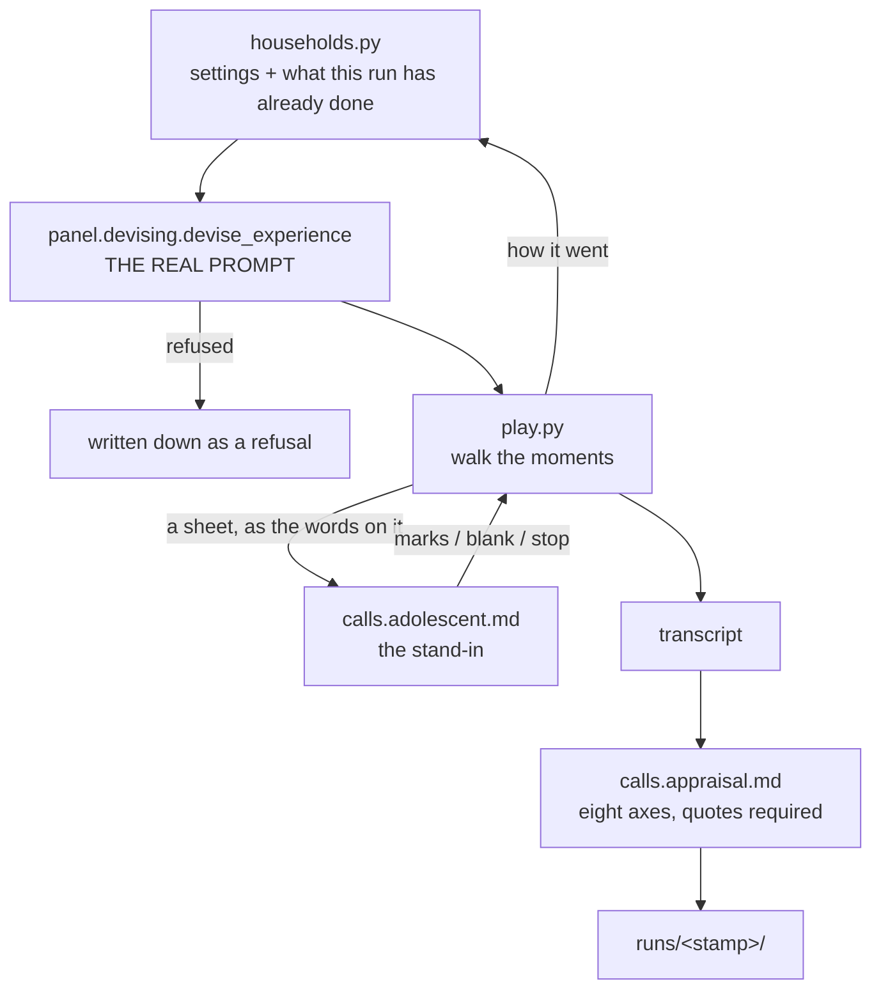

# A loop that plays activities against nobody

This is synthetic research, not part of the product. The textual loop generates activities through production functions and asks a model to play and appraise them. Its automatic findings have false positives and its transcript omits information. Its scores do not by themselves demonstrate a quality improvement.

Everything here is public and nothing in it was written by a person in a household. The synthetic households in [households.py](households.py) are invented and obviously so; the transcripts are two models talking to each other. That is the whole reason the outputs can be committed — see [What is published](#what-is-published).

```
research/
  households.py     six invented households, and what they have been through in this run
  run.py            the driver: devise → play → score → write it down
  play.py           walks an activity's moments with nobody in the room
  calls.py          the two model calls this loop makes that the house never makes
  calls.adolescent.md   what the stand-in is told
  calls.appraisal.md    the axes, and the demand for quoted evidence
  report.py         one run as a page somebody reads
  runs/<stamp>/     afternoons.json · summary.json · README.md
```

## How one activity goes through



The devising call is not a copy. `run.py` imports `panel.devising.devise_experience`, so a run exercises the prompt blocks in `agents/`, the format in `shared/experience.py`, the seven checks in `shared/experience_checks.py` and the Content Safety gate — and an activity the checks refuse is written down as a refusal rather than being retried until it passes. **A change to a prompt shows up here without anything in this folder being edited.** That is the design.

Within one run a household accumulates a memory, so the second activity is devised knowing how the first went, through `panel/what_happened.py`. A single activity cannot exercise that at all, which is why the driver takes `--iterations`.

## The two model calls that are ours

They live here and not in `agents/` on purpose. One stands in for a person and one grades work; putting either inside the product would put a judge of an adolescent's activity inside a system whose first rule is that it does not judge anybody.

**The stand-in** ([calls.adolescent.md](calls.adolescent.md)) is handed the screens so far and the sheet as the words that would be printed on it, plus how the day is going, and answers with what a scanner would see: `marks` or `blank`, what is on the paper described as ink, and whether this is where they stopped. It is told to work only from the sheet — a page that has to be guessed at is the thing being measured.

**The judge** ([calls.appraisal.md](calls.appraisal.md)) reads the transcript and scores the eight axes, **and every axis needs a line quoted word for word from the activity**. A score with nothing quoted is useless for tuning a prompt: what a prompt can be changed against is a line and a sentence saying what is wrong with it.

## The eight axes

Five come from [docs/EVIDENCE.md](../docs/EVIDENCE.md), which is the reading behind the design; three come from the design itself themselves. Each is scored 1–5 where 3 is "does the job", 1 is the failure the axis exists to catch and 5 is what it looks like when it is right.

| axis | what it catches | where it comes from |
| --- | --- | --- |
| `canBeStarted` | announcing what the activity is called instead of putting a situation in front of somebody | `EVIDENCE §1` |
| `sheetStandsAlone` | a sheet that only makes sense with a screen that has already gone | `EVIDENCE §1`, and the defect of 28 August |
| `oneThingAtATime` | how much has to be held together at once — not the same as length | COGA objective 3, `EVIDENCE §2` |
| `everyStepLeavesAMark` | a beat whose whole content is *notice which one lasts longer* | `ideas/09 §16` |
| `questionHasAWrittenAnswer` | a question the system cannot answer, handed to somebody who believes there is one | `EVIDENCE §3`, and the anagram of 28 August |
| `canBeAbandoned` | anything with a cost for stopping, and a way out reaching for an object nobody has | `ideas/09 §7` |
| `worthTheHour` | generic, tidy, about nothing in particular | `experience_prompt.what-makes-it-worth-doing.md` |
| `notASchoolSheet` | the teacher's voice, praise, blame, any remark on how it went | `shared/blocklist.py` |

Beside them the judge returns `worstLine`, `whatToChangeInThePrompt` and `howItWentInAWord`. The middle one is what a run is actually for.

## What the first three runs said

Same seed, same six households, four iterations each, three prompt states. 29 August 2026, in [runs/](runs).

| axis | first | after three sentences | in the object's voice |
| --- | ---: | ---: | ---: |
| `canBeStarted` | 4.57 | 4.78 | 4.71 |
| `everyStepLeavesAMark` | 3.76 | **4.30** | 3.92 |
| `canBeAbandoned` | 3.38 | 3.57 | **3.88** |
| `oneThingAtATime` | 3.52 | 3.22 | 3.46 |
| `worthTheHour` | 3.24 | 3.09 | 3.17 |
| `notASchoolSheet` | 2.48 | 2.09 | **3.08** |
| `questionHasAWrittenAnswer` | 2.43 | **3.13** | 2.79 |
| `sheetStandsAlone` | 1.95 | **3.61** | 2.88 |
| refused by the format | 3 | 1 | **0** |
| reached their close | 0 | 1 | **2** |

**One clean win.** The way out has to name its object in its own lines — the parser demanded it and the prompt never said so. Three refusals, then one, then none.

**One real tension, and the loop is what made it visible.** Telling a sheet to print what to do with it moved `sheetStandsAlone` by 1.66 and cost 0.39 on `notASchoolSheet`: a page that says plainly what to do reads like a worksheet. Softening it into the object's own voice gave the voice back — nearly a whole point — and returned about half the clarity. The two pull against each other and neither run is simply better than the other.

Those three states are historical. Current prompts changed again on 7 September 2026 to allow rich, open activities with explicit instructions. The older numbers are not measurements of the current prompts.

## What this does not answer

Stated here rather than discovered in a pull request.

- **A model standing in for an adolescent is a model writing what it thinks an adolescent would write.** That is a genre, not a person. A high score here means the activity survived a plausible reading; it does not mean anybody enjoyed it. The loop exists to make the first pass cheap, and it is meant to be replaced at the top by people.
- **No page is drawn.** An image is about 25 s and four cents, and this loop measures whether an activity works rather than whether it is pretty, so a sheet reaches the stand-in as the words that would be lettered onto it. Whether the drawing works is measured separately, by hand.
- **A branch that says `ask` ends the run.** The continuer is a second prompt with its own failures, and scoring a mixture of the two would produce a number that cannot say which one it is about. Those runs end `asked`, which is where *the apparatus* stopped and not where the activity did — the first run filed them as `way_out` and so reported that no activity ever reached its close, which was half true and read as worse than it was.
- **The judge and the devisor are the same family of model.** A shared blind spot is invisible to this apparatus by construction.
- **The axes are not independent.** An activity that cannot be started scores badly on most of them, so the mean across axes is a summary and not a measurement.

## Reading one

```powershell
python -m research.reader
```

Writes `build/research.html` and opens it: every activity of every run, and for each one the three things a score cannot be acted on without — the **input** that decided it (the household's settings, what had already been offered there, the method drawn from `methods/`), the **output** it produced (the overview, the script, the devised document and the transcript of it being played), and the **score** with the judge's sentence beside each axis. One self-contained file, no server, gitignored because it rebuilds in under a second.

Two smaller things come out of `python -m research.scores`, which runs at the end of a run and can be re-run at any time: `scores.json`, the eight axes per run, and `afternoons.md`, one line per activity across every run. Both are committed and small, so a change in a score shows up in a diff.

⚠️ This used to be a page in the parent's panel, and it was in the wrong product: axis means are a developer's material, and a parent has no decision that changes because one of them moved. It was removed on 4 September 2026 — route, section, catalogue strings and the one file the image carried for it.

## Running one

```powershell
. .\research\env.ps1
python -m research.run --iterations 4 --label after-the-sheets-rule
```

`--households` takes a name to run one alone. `--seed` fixes which mood and which weight each activity is drawn with, so two runs of the same prompts differ only by the model.

## The workbench

[officina.ipynb](officina.ipynb) calls `panel.devising.devise_experience`, draws pages, adds synthetic handwriting, reads it with `PageReader` and calls `panel.continuing.continue_experience`. [workbench.py](workbench.py) records successful and failed logical calls and saves synthetic images. It reports conclusion, error and interruption separately; fallback events remain explicit. The handwritten target receives the other available sheets as image references.

Run `python -m research.execute_officina` from the repository interpreter. It needs the `bench` extra and cloud dependencies. It saves notebook outputs even on failure. The notebook loads `research/env.ps1`, reloads prompts before constructing agents and creates a new output directory. It calls paid services. Its branch tests remove inherited cloud settings; do the same before running the complete pytest suite.

The run on 7 September 2026 completed in 345.4 seconds in the notebook executor, including 335.6 seconds inside the model-path verification. It drew two pages, read one synthetic return, sent seven descriptions in the continuation prompt and reached a close. An untouched-page control was blank and not degraded. [verification.json](runs/2026-09-07-officina-104746-339138/verification.json) stores the checks; the directory also holds prompts, responses and full-size images.

The workbench does not exercise device HTTP authentication, parent approval, deployed storage, physical printing or scanning, the household clock or the separate profile-placement task. Its `if_no_page` simulation exercises the contract; the current hub runner does not implement that branch. Consecutive non-collection moments do not wait their declared duration. A notebook completion therefore does not prove that an activity is paced or understood in a room.

The textual loop remains separate: it omits illustrations and help from parts of its transcript and stops at `ask`. Its appraisal assumes a single written answer in places where an open task may need examples or observation instead. Preserve its historical output, but do not use its counts as proof of quality. The reasoning and physical checks still needed are in [ideas/13](../ideas/13-prompts-and-simulation.md).


About **145 s and one and a half cents** per activity, measured 29 August 2026: one devising call, one call per sheet collected, one appraisal. Six households by four iterations is roughly an hour.

## What is published

`runs/` is committed. Each directory holds `afternoons.json` — everything, including full transcripts, the input each activity was devised from and the document that came back — `summary.json`, and a `README.md` that is the run as a page.

Nothing in it came from a person in a household: the settings are invented, the activities are generated, and both sides of every transcript are a model. Committing it is what makes two runs comparable with `git diff` and what lets somebody argue with a score by reading the quote under it.

Runs will be pruned. Keeping every one of them is keeping a lot of generated prose to say something a handful of them already say.
